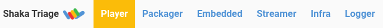

# Maintenance Processes

<details>
<summary>
<h2>Issue and PR Triage</h2>
</summary>

Issue triage should be handled regularly (recommend short daily sessions or
longer weekly sessions) to keep response times low.

We use an open-source tool called
[Triage Party](https://github.com/google/triage-party) to triage GitHub issues
and PRs.  This provides a unified view of issues across all of our repositories.
Though it is meant for maintainers, it is accessible to anyone, and does not
have any write permissions to any repos.

Our Triage Party instance provides views that are scoped to specific groups of
projects:
 - [Shaka Player](https://triage-party.shakalab.rocks/s/Player)
 - [Shaka Packager](https://triage-party.shakalab.rocks/s/Packager)
 - [Shaka Player Embedded](https://triage-party.shakalab.rocks/s/Embedded)
 - [Shaka Streamer](https://triage-party.shakalab.rocks/s/Streamer)
 - [Infrastructure projects](https://triage-party.shakalab.rocks/s/Infra)
 - [EME Logger](https://triage-party.shakalab.rocks/s/Logger)

You can navigate between projects using the headings in the top-left:



Within each project, there are tasks for triage, fixing bugs, and cleanup.  By
default, you get collections associated with triage.  You can navigate between
tasks by clicking the headings in the top-right:


The issues in the triage collections should be investigated in order.  For
example, "untyped issues" should have their type set (`type: bug`,
`type: enhancement`, `type: question`, etc.), then "unprioritized issues"
should have a priority label set (`priority: P1`, `priority: P2`, etc.)

Each task has a description, and each issue in that list can be clicked to open
a new tab to the issue on GitHub.  Tasks can be collapsed by clicking on the
heading.

Our triage party instance is customized, configured, built, and deployed from
[shaka-project/triage-party-config](https://github.com/shaka-project/triage-party-config).
Any time changes are merged to the `main` branch, the instance is automatically
updated through Google Cloud Build and deployed to Google Cloud Run.
</details>


<details>
<summary>
<h2>Versioning</h2>
</summary>

### Semantic Versioning

Shaka Player uses semantic versioning for releases (see
[semver.org](https://semver.org/)).  This is expected for packages in the
JavaScript ecosystem, and is generally understood by developers.

Version numbers have three numeric components separated by dots, and an
optional prerelease tag.  Versions look like this: MAJOR.MINOR.PATCH, and the
rules can be summarized as:

1. Increment MAJOR when you make incompatible API changes,
2. Increment MINOR when you add functionality in a backwards compatible manner,
3. Increment PATCH when you make backwards compatible bug fixes.

Unless otherwise noted (for a specific project), release versioning is
automated as part of the release workflow.


### Conventional Commits

Conventional Commits is a syntax for commit messages that helps automate
semantic versioning (see [conventionalcommits.org](https://conventionalcommits.org/)).
In short, every commit message should begin with a commit type and a colon,
such as "fix: ..." for backward compatible bug fixes, "feat: ..." for backward
compatible features, or "feat!: ..." for a breaking change.

The automated release workflow will parse these commit messages to determine
what the release version should be.  If no features have been added, the PATCH
number is incremented.  If only backward compatible features have been added,
the MINOR number is incremented.  If breaking changes have been added, the
MAJOR number is incremented.  See the rules for
["Semantic Versioning"](#semantic-versioning) above.
</details>


<details>
<summary>
<h2>PR Process</h2>
</summary>

PR titles and descriptions should follow [Conventional Commits syntax](https://www.conventionalcommits.org/).
This is enforced already by GitHub Actions for most of our repositories
(excluding non-releasing repos for things like infrastructure).

If a PR title does not meet the requirements, a required check will fail and
the PR cannot be merged.  As a maintainer, you can simply edit the PR title,
and the check will be run again.

If you are a maintainer, you should install the
[Squashed Merge Message browser extension](https://github.com/zachwhaley/squashed-merge-message#install)
to make sure your PR commits match the PR title and description.  The extension
will override the default commit message provided by GitHub when you merge a PR.
(If the extension doesn't work the first time, just reload the page.)

This ensures that PR commits follow Conventional Commits syntax, which will in
turn drive the generation of changelogs and releases.
</details>


<details>
<summary>
<h2>Release Process</h2>
</summary>

Releases are generally automated through a tool called [Release Please](https://github.com/googleapis/release-please).
A GitHub Action will watch the commit messages of all new changes to the `main`
branch or configured release branches, and automatically generate or update a
release PR.  This PR will update version numbers and changelogs.

Version number changes respect [Semantic Versioning](https://semver.org/),
based on [Conventional Commits](https://conventionalcommits.org/) syntax in the
commit messages.  See ["Versioning"](#versioning) above.

To start the release process, just approve and merge the automated release PR.
The Action will run again, this time creating tags and GitHub releases, as well
as any NPM, PyPi, or other releases necessary.

> :information_source: **NOTE**: Our release PRs do not automatically trigger
> the PR title check.  (We don't know why not.)  To get the title check to run,
> you may need to approve the PR or make a no-op change to the title.

> :information_source: **NOTE**: The following repositories have not yet
> adopted the release automation described here:
> - [Shaka Packager](https://github.com/shaka-project/shaka-packager)
> - [Shaka Player Embedded](https://github.com/shaka-project/shaka-player-embedded)
> - [Shaka Streamer](https://github.com/shaka-project/shaka-streamer)


### Per-Project Release Processes

 - [Shaka Player](shaka-player.md)

> :pencil: **TODO**: Add more per-project release process docs.
</details>


<details>
<summary>
<h2>Fixing Release Notes</h2>
</summary>

If you merge a PR and want to fix the release notes for it before release, you
can edit the PR description and append an "override" block.  This is a feature
of Release Please.

Example:

```
BEGIN_COMMIT_OVERRIDE
feat: add ability to override merged commit message

fix: another message
chore: a third message
END_COMMIT_OVERRIDE
```

Upstream documentation:
  https://github.com/googleapis/release-please#how-can-i-fix-release-notes
</details>


<details>
<summary>
<h2>Automated Maintenance</h2>
</summary>

See also these automated systems which are widely deployed across our repos:

 - https://github.com/shaka-project/shaka-github-tools/tree/main/update-issues
 - https://github.com/shaka-project/shaka-github-tools/tree/main/sync-labels
 - https://github.com/shaka-project/shaka-github-tools/tree/main/validate-pr-title
 - https://github.com/shaka-project/shaka-github-tools/blob/main/.github/workflows/sync-common-workflows.yaml
</details>
